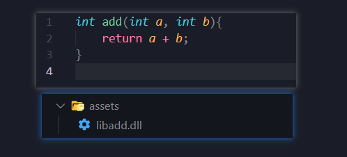
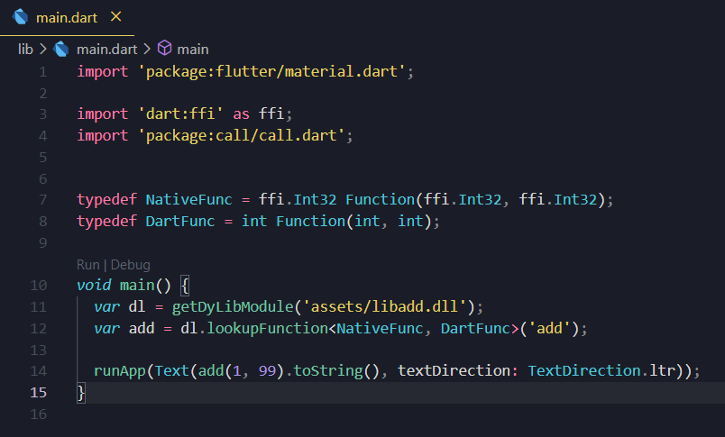
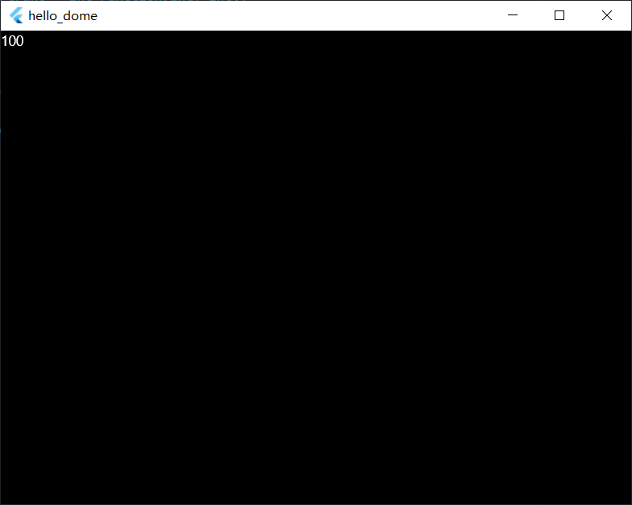

# call

Using assets's way to call Dynamic Library more conveniently and easily.

## First
Write your C-code, and compile it to a dylib.
Example:
```sh
gcc -shared -fPIC -o libadd.dll main.c
```


## Second
You should declare path of the dylib in the `pubspec.yaml` file as images.

## Third
Let's write some easy flutter code to test it.


## Fourth
I use the Windows OS now, and run the app by `flutter run -d Windows`.


Finally, you can see the number, 100!!!
